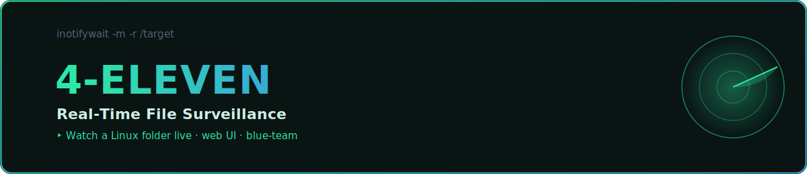

<p align="center">
  
</p>

<p align="center">
  
  
  
</p>

# 📁 4-Eleven – Surveillance de fichiers en temps réel

**4-Eleven** est une application de démonstration de sécurité, permettant de **surveiller en temps réel un dossier** sur un système Linux (ex : Kali) et de visualiser tous les changements effectués (création, modification, suppression, changement de permissions, etc.) via une interface web moderne.

---

## ✨ Fonctionnalités principales

### ✅ 1. Sélection du dossier à surveiller
- L'utilisateur peut saisir **le chemin absolu d'un dossier** qu'il souhaite surveiller.
- Ce chemin est envoyé au serveur pour initier la surveillance via `chokidar`.
- Exemple : `/home/waterjuice/Desktop/test-folder`

---

### 👀 2. Surveillance en temps réel
- Une fois le chemin sélectionné, le backend utilise **`chokidar`** pour surveiller tous les fichiers et sous-dossiers.
- Les événements captés :
  - 📄 `add` : Fichier ou dossier créé
  - 📝 `change` : Fichier modifié
  - ❌ `unlink` : Fichier supprimé
  - 🔐 `permission-change` : Modification des droits d’accès (ex : 755 ➜ 700)

---

### 🔄 3. Affichage des logs en temps réel
- La page **/logs** affiche les événements capturés **en live** grâce à **Socket.IO**.
- Chaque log contient :
  - Type d’action (ADD, CHANGE, UNLINK, etc.)
  - Chemin complet du fichier
  - Anciennes et nouvelles permissions si applicable

---

## 🎨 Interface utilisateur

- Interface **simple et épurée** avec des couleurs spécifiques à chaque type d’événement :
  - 🟢 `ADD` → fond vert foncé
  - 🟡 `CHANGE` → fond jaune foncé
  - 🔴 `UNLINK` → fond rouge foncé
  - 🟠 `PERMISSION-CHANGE` → fond orange foncé
- Développement frontend avec **React + Vite**
- Design léger sans framework CSS externe pour garantir compatibilité et simplicité.

---

## 🧠 Architecture technique

### Backend (Node.js + Express + Socket.IO)
- API REST pour démarrer la surveillance (`POST /start-watcher`)
- WebSocket pour émettre les logs
- Surveillance avec `chokidar` (événements de filesystem)

### Frontend (React)
- `PathSelector.tsx` : Page de saisie du chemin
- `LogViewer.tsx` : Interface d'affichage en temps réel

---

## 🛠️ Installation & Démarrage

### 1. Backend

```bash
cd backend
npm install
npm run dev
